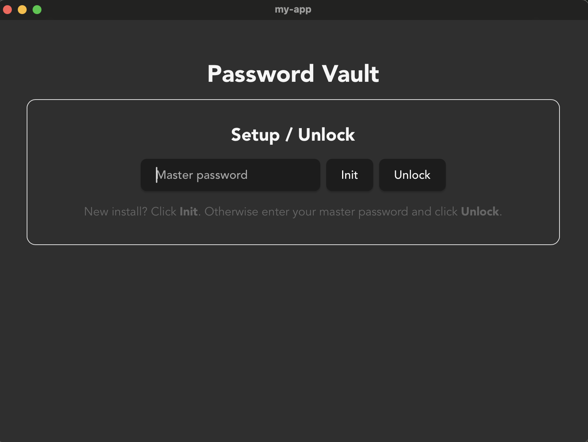
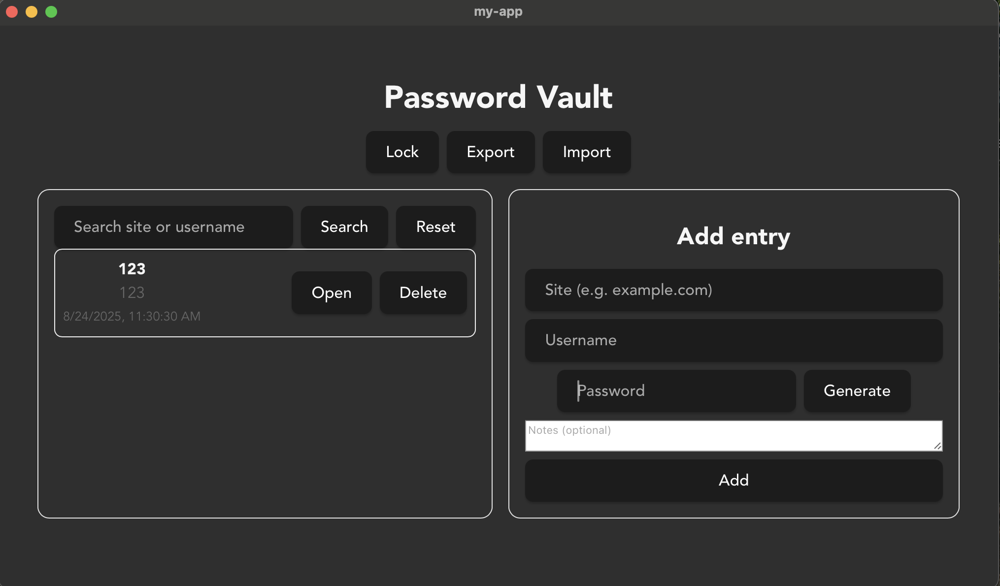

# Password Vault — Quick Guide

A simple local password manager with a clean GUI (Tauri + React). Your data is stored in a local SQLite database and protected by a master password. Nothing is sent to the cloud.

Screenshots

Welcome / Unlock screen: 

Main screen: 

## Getting Started
Prerequisites

Rust (stable) BACKEND

Node.js (LTS) FRONT

Install & Run (dev)
git clone <repo-url>
cd <repo>
npm install
npm run tauri dev

## Build
npm run tauri build
# Binaries will be in src-tauri/target/release (platform-specific)

## How to Use

First run (Setup):
On the Welcome screen, enter a master password and click Init.
Keep this password safe — without it you cannot access or restore your data.

Unlock:
Enter the same master password and click Unlock.
Use Lock to lock the vault at any time.

Add an entry:
In Add entry, fill Site, Username, Password, and optional Notes.
Click Generate to create a strong random password.

List & Search:
The left panel shows all entries. Use Search (by site or username) and Reset to clear the filter. Click an item to open it.

View & Edit:
The selected item shows its Decrypted password.
Use Edit entry to change fields. Leave “New password” empty to keep the current one.
Use Delete to remove an entry.

## Backup & Restore:

Export creates an encrypted .vault backup file.

Import loads a .vault file and adds its entries to your vault.

Note: You must unlock with the same master password that was used to create the backup. Imports may add duplicates.

## What the Buttons Do

Init / Unlock / Lock — set up, open, and lock the vault

Search / Reset — filter the list and clear the filter

Add entry / Generate — create a new record; generate a strong password

Edit entry / Save / Delete — update or remove the selected record

Export / Import — make an encrypted backup and restore from one

## +
Error handling via try catch (ts) and via match in Rust
